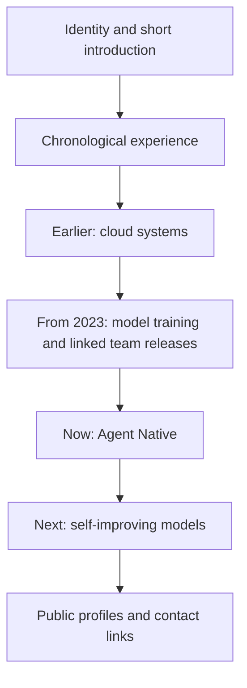

# Personal homepage — approved timeline design

## Goal and approval

Design approved on 2026-09-18, with a refinement: make the page read like a resume, using a chronological timeline. Retain the restrained geek style, but prioritize comprehension over a large promotional hero.

Confirmed trajectory: past LLM training engineer → currently building Agent Native systems → future exploration of self-improving models and metaRSI. Earlier Tencent Cloud OS experience provides systems-engineering context; no employment dates are invented.

## Content and architecture

Static HTML and CSS. No JavaScript, API calls, forms, analytics, framework, package dependencies or build step. Deployment is GitHub Pages from main / root with `.nojekyll`.

## Visual and interaction contract

- Charcoal background, warm white type, lime highlighting the present stage.
- Compact identity panel with a readable vertical timeline alongside it on desktop; stacked on mobile.
- Each timeline entry has a period, role, organization/context, concise summary, and relevant evidence links.
- Dates only where supported; use Earlier / Now / Next for unspecified periods and future interests.
- Team model releases are attributed to xDAN AI, never sole personal authorship.
- Real anchor links, keyboard focus, skip link, 44px mobile targets and reduced motion.
- Print CSS produces a readable light resume without decorative navigation.
- No unverified rankings, quantitative savings, private material or implied current self-evolution capability.

## File list

- `index.html`: semantic page, metadata and canonical URL.
- `styles.css`: layout, typography, mobile and print styles.
- `favicon.svg`: original typographic monogram.
- `.nojekyll`, `robots.txt`, `sitemap.xml`: Pages and discovery.
- `README.md`: maintenance and publishing instructions.
- `docs/feat-geek-homepage/`: public design and validation record.
- `tasks/`: progress, lessons and handoff.

## Publishing contract

Create `cryptoSUN2049/cryptoSUN2049.github.io`, publish validated static files to main, enable Pages with `source.branch=main` and `source.path=/`. The live canonical URL is `https://cryptosun2049.github.io/`. Do not expose credentials or unrelated local documents. After live verification update the GitHub account blog URL; preserve unrelated profile fields.

## Verification

Inspect desktop/mobile at 320, 768, 1024 and 1440px; verify no horizontal overflow, valid anchors, one h1, keyboard focus, contrast, print styling, readable content, successful assets and no console errors. Check model and profile links. Run `git diff --check`, `ruff check .`, and `ruff format --check .` before each push. Verify Pages deployment status and live rendered content before completion.
